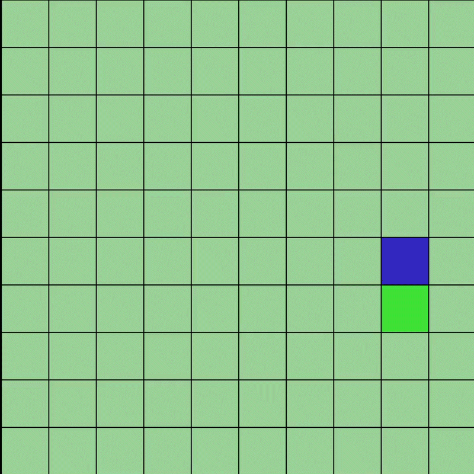

# neural-engine

Neural network engine with autograd, built from scratch. No ML libraries.

## What's in it

| File | Description |
|------|-------------|
| `engine.py` | Scalar autograd engine — `Value`, `Layer`, `loss`, `log_softmax` |
| `neural_network.py` | `NeuralNetwork` and `LinearConfig` |
| `apple_gym.py` | Pygame grid environment |
| `train_apple_gym.py` | Policy gradient training loop |

## Autograd

Every number is a `Value`. Operations build a computation graph. `.backward()` walks it in reverse and applies the chain rule.

```python
x = Value(3.0)
y = Value(2.0)
z = x * y
z.backward()
# x.grad = 2.0, y.grad = 3.0
```

Supported ops: `+` `-` `*` `/` `**` `exp` `log` `relu`

## Requirements

Python ≤ 3.13.12 — pygame does not support Python 3.14+.

## Example — Apple Gym



An agent on a 10×10 grid learns to reach an apple using policy gradients. State is the relative position of the apple. Actions are up/down/left/right.

```
pip install pygame
python train_apple_gym.py
```

## License

MIT
